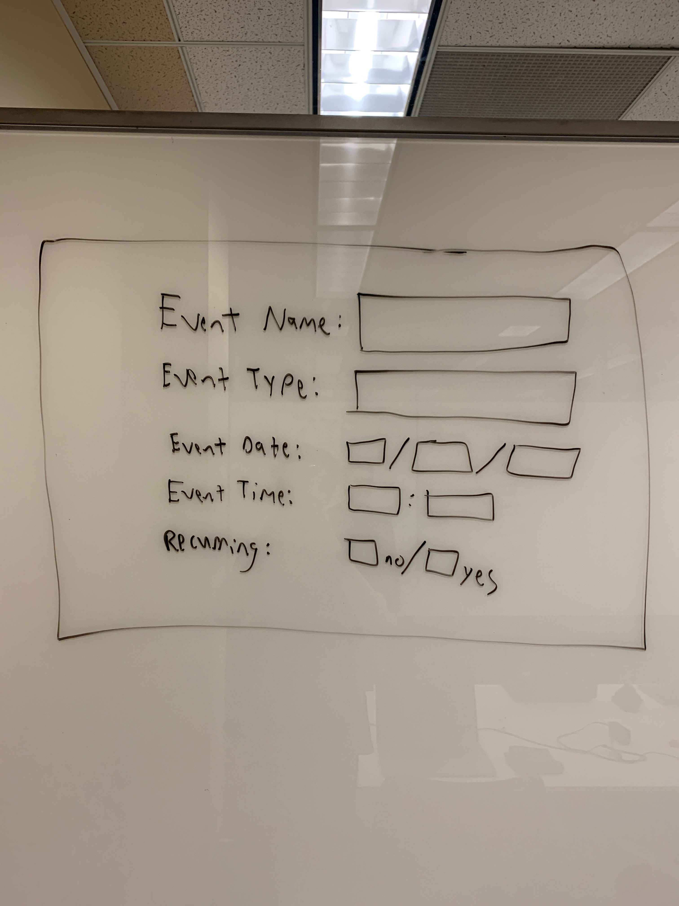
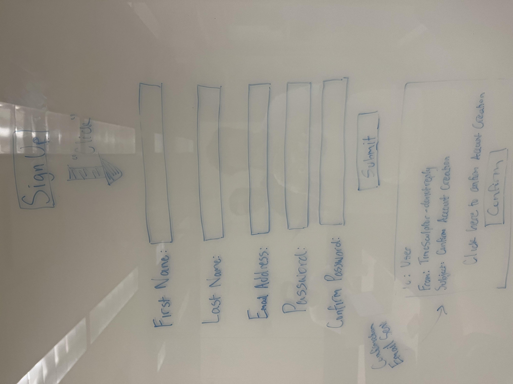
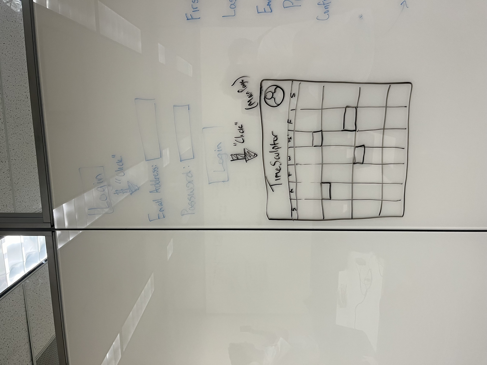
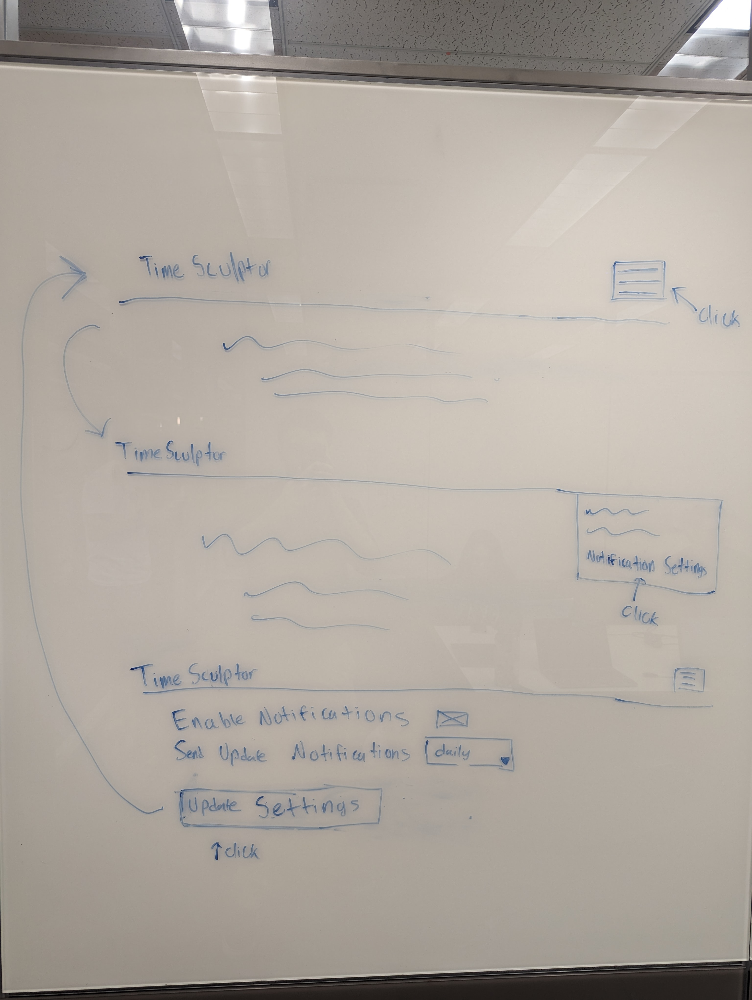

# Project Requirements

Group 4: **TimeSculptor**

**Date and Location:** September 22, 2023

**Group Members:**

- Gabriel Valentin
- Izaac Molina
- Joey Banazsak
- Kimberly Allison
- Nicholas Wiley
- Noah Schwartz

## 1. Positioning

**Problem Statement:**\
The problem of disorganization and lack of prioritization of tasks in any given day affects those of us with ADHD or those that lack Executive Function skills the impact of which is losing out or missing important tasks or commitments in one's life.

**Product Position Statement:**\
For those who struggle with ADHD or Executive Function who could greatly benefit from a scheduling app designed specifically with their needs in mind TimeSculptor is a scheduling application that will greatly assist in organizing one's life who struggles to do it themself. Unlike Google Calendar, handwritten notes, etc. our product is accessible via the Web, etc.

**Value Proposition:**\
TimeSculptor is a scheduling app; targeted for people who struggle ADHD; provides a much easier and accessible interface for those people and features ADHD friendly User Interface. The expected consumer segment are individuals suffering from ADHD.

## 2. Stakeholders

## 3. Functional Requirements

- Calendar app that schedules events for you
- Simple but intiuitive
- Must sync online and store information offline
- Take in calendars from other programs
- Easily create schedules
- Has to implement C/C++

## 4. Non-functional Requirements

- Accessibility (Target audience is people who struggle with attention deficit therefore this must be easy for them to use)
- Convenience (We must avoid our program feeling like too much work for the user or they will not use it)

## 5. Minimum Viable Product

**MVP Features:**

- Display a correctly formatted calender
- Display events in correct time slots
- Easily move around and create new events
- Save and load schedules
- Plans specified events without user input
- Sends notifications to users with reminders

## 6. Use Cases

|Use Case 1 | Adding a new event |
|:---|:---|
**Actor** | **User** |
**Basic Flow** | **User loads the desired schedule. Then they add a new schedule element. Then they set the time the event happens and a name and description of the event.** |

|Use Case 2 | Register/Login |
|:---|:---|
**Actors** | **User,** **TimeSculptor Web Application** |
**Register** | **The user navigates to the web application's homepage. On the homepage, the user clicks on the "Sign Up” button to start the registration process. The web application presents a registration form, which will probably includes fields such as: Full Name, Email Address, Password, Confirm Password. The user completes the registration form. If the input is valid, the web application creates a new user account and stores the provided information in the database. The web application sends a confirmation email to the user's provided email address containing a verification link. The user checks their email inbox, clicks on the verification link, and confirms their email address. Upon successful email verification, the web application displays a confirmation message to the user, informing them that their registration is complete.** |
**Login** | **The user navigates to the web application's homepage. On the homepage, the user clicks on the "Login" button to start the login process. The web application presents a login form, requesting the user's login info. The user enters their information into the login form. The web application verifies the entered credentials against the stored user data in the database. If the entered credentials are correct, the web application authenticates the user and grants access to their account. The user is redirected to the application's main dashboard or landing page.** |

|Use Case 3 | Save/Load Schedule |
|:---|:---|
**Actors** | **User / TimeSculptor Application** |
**Save Schedule** | **Once user is logged in and has found their way to the homepage, they will be able to generate/edit their schedule. Once finished, they will be given the option to save their schedule. This will offer a confitmation and overwrite their previous save file.** |
**Load Schedule** | **Once user is logged in and has found their way to the homepage, their previously saved schedule will be automatically loaded and brought up into their calendar.** |

|Use Case 4 | Notifications Settings |
|:---|:---|
**Actors** | **User / TimeSculptor Application** |
**Setup Notifcations** | **Once logged in, the user goes to the settings menu and selects "Notifications". Upon doing this, the user will be brought to a Notifications settings page where they can decide what time interval for receiving notifications, such as daily, weekly, etc. The user then selects "Confirm", which stores the user's notification settings. After this, the user will then receive notifcations to update their schedule based on the time interval they selected** |
**Update Notifications** | **Once logged in, the user goes to the settings menu and selects "Notifications". Upon doing this, the user will be brought to a Notifications settings page where they can change what time interval for receiving notifcations. The user then selects "Confirm", which updates the user's notification settings. After this, the user will then receive notifcations to update their schedule based on the updated time interval they selected.** |

## 7. User Stories

As a person with ADHD, I want the scheduling app to automatically place specified events in my schedule so that I am not overwhelmed with planning.

As a user with ADHD, I want to create multiple schedules so that I can remember the schedules of others.

As a user unfamiliar with scheduling apps, I want an easy to use interface so that I can easily and quickly add events to my calendar.

As a person belonging to many different organizations, I want a nice color-coding system so that I can differentiate between my groups' activities.

As someone who grew up around people with attention deficit, I want a convenient way to make a schedule for them so that they can stay productive and focused.

As a working parent of two attention deficit children, I want help creating a routine so that I can keep them on track in school.

As a student with ADHD, I want my schedule to immediately populate with my classes so that it’s as easy as possible to keep track of them.

As a worker with ADHD, I want my scheduling app to remind me to update it, so that I don’t forget and lose track of my schedule.

## 8. Issue Tracker
