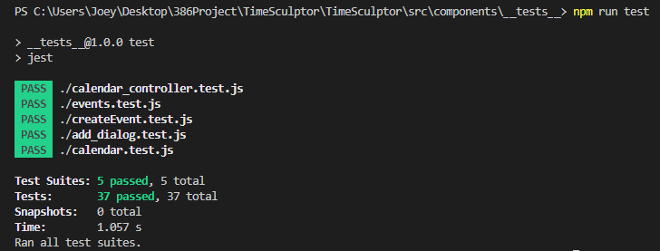

Group 4: **TimeSculptor**

**Date:** November 19, 2023

**Group Members:**

- Gabriel Valentin
- Izaac Molina
- Joey Banazsak
- Kimberly Allison
- Nicholas Wiley
- Noah Schwartz

# Introduction
 TimeSculptor is a scheduling app that aims to provide a seemless and user friendly experience, with a particular emphasis on being accessible for people with learning disabilities. It provides an accessible interface that adheres to guidelines outlined in [Pavlov (2014)](https://www.scirp.org/html/7-9301792_43152.htm) and [Moreno et al. (2023)](https://link.springer.com/article/10.1007/s10209-023-00986-z). The primary expected consumer segment individuals who possess learning disabilities, but this ultimately makes the app accessible for everyone. Upon logging in, you are then given the options to create events or edit your schedule's current events. You can utilize color coding, and assigning different symbols to your events. Additionally, there are three viewing modes: list, monthly, and daily.

[TimeSculptor](https://github.com/nickw409/TimeSculptor)

# Implemented Requirements

# Tests

For the testing of our program we decided to use jest as our automated testing software. 

link for testing: [Here](https://github.com/nickw409/TimeSculptor/tree/main/TimeSculptor/src/components/__tests__)

an example of a test case is the [calendar.jsx](https://github.com/nickw409/TimeSculptor/tree/main/TimeSculptor/src/components/calendar.jsx) file, in our tests, the first test in the [calendar.test.js](https://github.com/nickw409/TimeSculptor/tree/main/TimeSculptor/src/components/__tests__/calendar.test.js) file is seeing that the correct month is displayed based on a set of mock events and date. 

Below is the output of the current tests being ran:

# Demo

# Code Quality

To foster code quality, we implemented a system where all major components and functions are commented with their purpose, along with the parameters they receive and value(s) they return. Additionally, we also refactored our code to specifically follow SOLID principles, such as how the Event class has the single responsibility of holding data for each displayed event.

# Lessons Learned

Throughout the course of creating this first release, we have learned a lot about the use of react.js, node.js, and jest. In particular, the group learned a great deal about how to design event listeners in React, as well as how to use the React mui library to implement useful features like dropdown menus and add/edit/delete dialogues. In the future, we want to will further improve the UI by thoroughly examining further acessibility requirements and applying them to our design. Additionally, some other immediate next steps for the project are to implement a full user registration and login system, designing a calendar view for events, implementing user settings, and setting up a SQL database for our classes.

